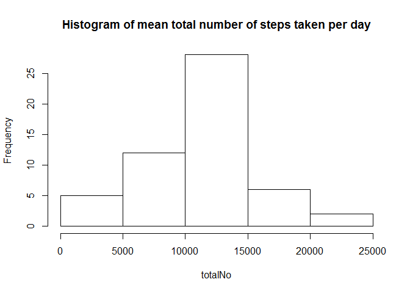
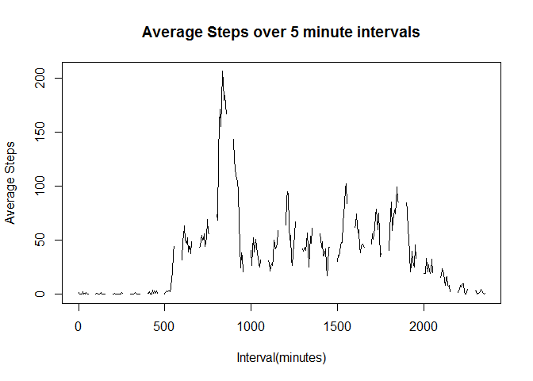
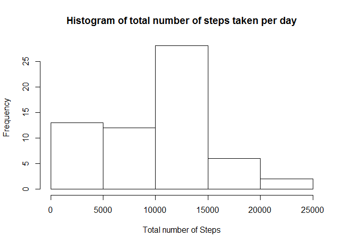
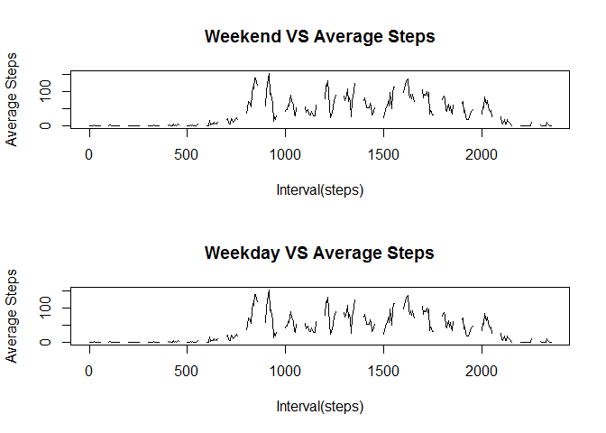

# Reproducible Research: Peer Assessment 1


## Loading and preprocessing the data

```r
dataRaw <- read.csv('activity.csv')
dataRaw$date <- as.Date(dataRaw$date, "%Y-%m-%d")
dataRawSub <- split(dataRaw, dataRaw$date)
```


## What is mean total number of steps taken per day?

```r
totalNo <- sapply(dataRawSub, function(t) sum(t$steps))
medianNo <- sapply(dataRawSub, function(t) median(t$steps))
hist(totalNo, main = "Histogram of mean total number of steps taken per day")
```

<!-- -->

## What is the average daily activity pattern?

```r
gaps <- seq(0, 2355, 5)
stepsNo <- numeric()
for(i in 1:472)
{
  stepsNo[i] = 0
}
averageSteps = data.frame(gaps, stepsNo)
names(averageSteps) = c('gaps', 'averagesteps')

for(i in 1:472)
{
  averageSteps$averagesteps[i] = mean(dataRaw$steps[dataRaw$interval == gaps[i]], na.rm = TRUE)
}

plot(averageSteps, type='l', main='Average Steps over 5 minute intervals',xlab='Interval(minutes)', ylab='Average Steps')
```

<!-- -->

```r
averageSteps$gaps[which.max(averageSteps$averagesteps)]
```

```
## [1] 835
```

## Imputing missing values

```r
numberNa = sum(is.na(dataRaw$steps))
```
The number of NA values in the dataset is 2304


```r
rmNa = dataRaw
rmNa[is.na(rmNa)] = 0
subNa = split(rmNa, rmNa$date)
totalNumNa = sapply(subNa, function(n) sum(n$steps))
hist(totalNumNa,main="Histogram of total number of steps taken per day", xlab="Total number of Steps")
```

<!-- -->

```r
meanNa = sapply(subNa, function(n) mean(n$steps))
medianNa = sapply(subNa, function(n) median(n$steps))
```


## Are there differences in activity patterns between weekdays and weekends?

```r
weekInfoData = dataRaw
weekInfoData[is.na(weekInfoData)] = 0
weekInfoData$days = weekdays(weekInfoData$date)
weekInfoData$days = as.factor(ifelse(weekdays(weekInfoData$date) %in% c("Saturday","Sunday"), "Weekend", "Weekday"))

meanEnd = mean(weekInfoData$steps[weekInfoData$days == 'Weekend'])
meanDay = mean(weekInfoData$steps[weekInfoData$days == 'Weekday'])

weekInfodays = subset(weekInfoData, weekInfoData$days == 'Weekday')
weekInfoends = subset(weekInfoData, weekInfoData$days == 'Weekend')

weekend = numeric()
weekday = numeric()
for(i in 1:472) {
  weekday[i] = 0
  weekend[i] = 0
}

meanWeek = data.frame(gaps, weekend, weekday)
names(meanWeek) = c('interval','averagegsteps.weekend','averagegsteps.weekday')

for (i in 1:472){
  meanWeek$averagegsteps.weekday[i] = mean(weekInfodays$steps[weekInfodays$interval == gaps[i]], na.rm=TRUE)
  meanWeek$averagegsteps.weekend[i] = mean(weekInfoends$steps[weekInfoends$interval == gaps[i]], na.rm=TRUE)
}

par(mfrow=c(2,1))
plot(meanWeek$interval, meanWeek$averagegsteps.weekend, type='l', main ="Weekend VS Average Steps",
     xlab="Interval(steps)", ylab="Average Steps")
plot(meanWeek$interval,  meanWeek$averagegsteps.weekend, main ="Weekday VS Average Steps", 
     xlab="Interval(steps)", ylab="Average Steps", type='l')
```

<!-- -->
